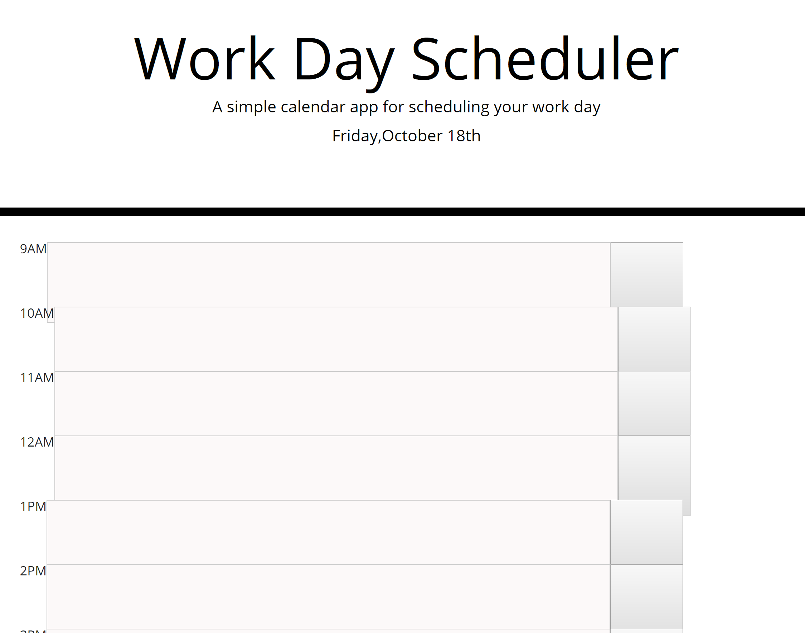
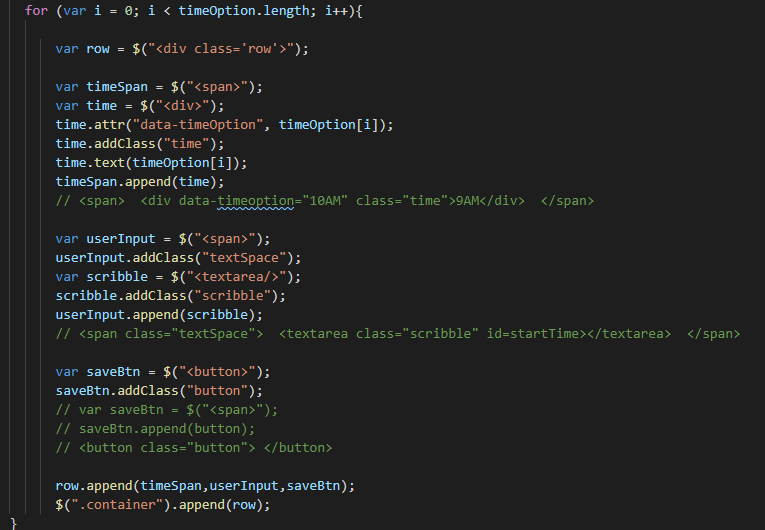

# Homework5
<How to add : img src="foldername/filename" width="%" height="%">

//----------------------------------------------------------

1. One row maded - time, textarea, button

2. The rows are made

3. The class and id are added to row elements (timeSpan,userInput, saveBtn)

